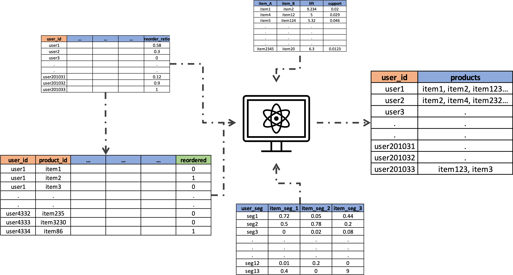

# Instacart Next Order Prediction
This project aims to leverage Instacart’s extensive dataset to predict which previously purchased products will be included in a user’s next order. 
By employing advanced feature engineering and machine learning techniques, the goal is to develop a ensemble of models to enhance Instacart’s recommendation system and predict User’s next order. 
This will not only improve customer satisfaction by anticipating their needs but also drive sales through personalized shopping experiences.

### Problem Statement

Dataset: "The Instacart Online Grocery Shopping Dataset 2017”, Accessed from on 2024-06-20. (https://tech.instacart.com/3-million-instacart-orders- open-sourced-d40d29ead6f2)
